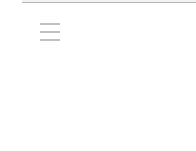
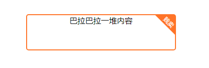
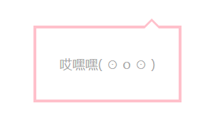

# css-style
各种值得收藏的样式111111
只是收藏自己喜欢的样式，看到喜欢的自己写一写，然后放上来

### 输入框样式

最近非常常见的输入框样式，点击输入时提示上移

demo地址 ： https://ogurigin.github.io/css-style/input/input-type1

### 动态样式

一些简单的动态效果

1.可旋转的列表icon

效果图 ： 

demo地址 ： https://ogurigin.github.io/css-style/transition/list-Transiton.html

### 静态样式

就是一些简单的静态css样式

1.带边框斜角标

效果图

demo地址：https://ogurigin.github.io/css-style/all/corner.html

2.一个粉粉的爱心

效果图

demo地址：https://ogurigin.github.io/css-style/all/radiusHeart.html

3.带三角形的边框

效果图

 

demo地址：https://ogurigin.github.io/css-style/all/triangleBorder.html

4. 纯css搞定顶部滚动条

   ​	demo地址：https://ogurigin.github.io/css-style/all/top-scrollbar.html  

   

5. 各种居中，包括固定宽高  以及不固定宽高

   ​	demo地址：https://ogurigin.github.io/css-style/all/centerVertically.html

6. 纯css实现每个单词首字母大写

   demo地址：https://ogurigin.github.io/css-style/all/text-transform.html

   
7. 旋转美少女 ---魔方轮播

   demo地址：https://ogurigin.github.io/css-style/all/cuber.html

   ​	
8. 翻转时钟  ---自己记得时不时看看代码！！

   demo地址：https://ogurigin.github.io/css-style/all/flipClock.html	
   
9. 天气小图标  ---看到喜欢的可以更新

   demo地址：https://ogurigin.github.io/css-style/all/weather.html	
   ​	

   

   

   

   
